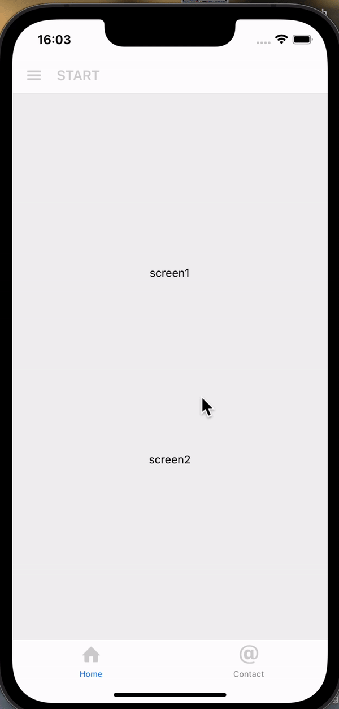

# Final Result

## The App

The app itself is consisted by two Screens. The Home screen is the first screen, where you can navigate to Screen 1 and 2. The second screen is the contact Us screen, we also have the screens inside the Drawer Navigator, but all of them expect for the Sign Out one, navigate to Screen 1 or Screen 2. For The Sign Out we just output an console.log.

## Improvements

All the inline styles needs to be replaced for a StyleSheet object or anything similar

A better place to place the animation would be the header, instead of the screen itself, but there wasn't enough time available for both of improvements